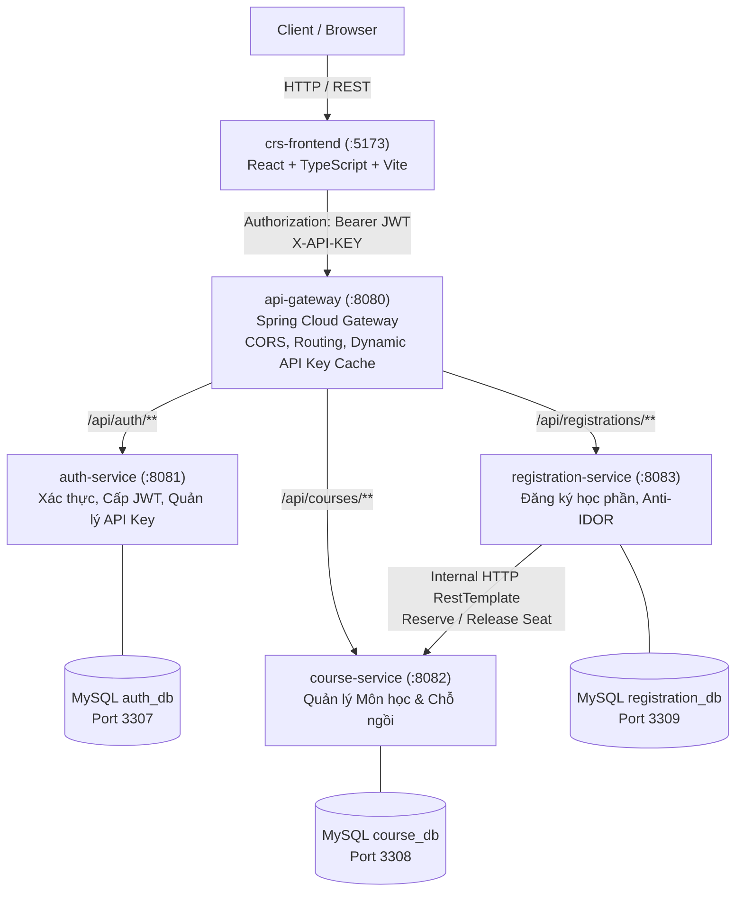

# 🎓 Course Registration System (CRS) - Microservices Architecture

> Hệ thống Đăng ký Học phần Trực tuyến xây dựng theo kiến trúc **Microservices** hiện đại, áp dụng mẫu thiết kế **Database-per-Service**, xác thực tập trung **JWT**, bảo vệ API đối tác với **API Key Cache**, và định tuyến qua **Spring Cloud Gateway**.

---

## 📑 Mục lục
- [1. Kiến trúc Hệ thống](#1-kiến-trúc-hệ-thống)
- [2. Danh mục Microservices & Cổng kết nối](#2-danh-mục-microservices--cổng-kết-nối)
- [3. Công nghệ sử dụng](#3-công-nghệ-sử-dụng)
- [4. Các tính năng nổi bật](#4-các-tính-năng-nổi-bật)
- [5. Tài khoản thử nghiệm mặc định](#5-tài-khoản-thử-nghiệm-mặc-định)
- [6. Hướng dẫn Khởi chạy Hệ thống](#6-hướng-dẫn-khởi-chạy-hệ-thống)
  - [Cách 1: Khởi chạy 1-Click bằng Script (Khuyên dùng khi dev Local)](#cách-1-khởi-chạy-1-click-bằng-script-khuyên-dùng-khi-dev-local)
  - [Cách 2: Khởi chạy bằng Docker Compose](#cách-2-khởi-chạy-bằng-docker-compose)
  - [Cách 3: Khởi chạy thủ công từng Service](#cách-3-khởi-chạy-thủ-công-từng-service)
- [7. Bản đồ API (API Blueprint Overview)](#7-bản-đồ-api-api-blueprint-overview)
- [8. Hướng dẫn Đẩy Code lên GitHub trong IntelliJ IDEA](#8-hướng-dẫn-đẩy-code-lên-github-trong-intellij-idea)

---

## 1. Kiến trúc Hệ thống



---

## 2. Danh mục Microservices & Cổng kết nối

| Dịch vụ / Service | Cổng (Port) | Cơ sở dữ liệu | Cổng MySQL | Mô tả vai trò |
| :--- | :--- | :--- | :--- | :--- |
| **`api-gateway`** | `8080` | *Không dùng* | - | Điểm đón request duy nhất (Single Entry Point), điều hướng Reverse Proxy, kiểm soát CORS, xác thực API Key với Cache. |
| **`auth-service`** | `8081` | `auth_db` | `3307` | Đăng nhập, cấp phát JWT Token (Admin / Student), mã hóa BCrypt, sinh và thu hồi API Key đối tác. |
| **`course-service`** | `8082` | `course_db` | `3308` | Tra cứu danh sách môn học (tìm kiếm, phân trang), CRUD học phần (Admin), API nội bộ trừ/hoàn chỗ ngồi. |
| **`registration-service`** | `8083` | `registration_db` | `3309` | Đăng ký môn học, tra cứu danh sách đã đăng ký (`/my`), hủy đăng ký, gọi liên dịch vụ sang `course-service`. |
| **`crs-frontend`** | `5173` | *Browser LocalStorage* | - | Giao diện Single Page Application (SPA), tích hợp Axios Interceptor, bảng điều khiển Admin & Sinh viên. |

---

## 3. Công nghệ sử dụng

- **Backend**:
  - Java 21, Spring Boot 3.x
  - Spring Cloud Gateway (Reactive Gateway)
  - Spring Security + JJWT (JSON Web Token)
  - Spring Data JPA, Hibernate, MySQL Connector/J
  - Lombok, RestTemplate / WebClient
- **Database**:
  - MySQL 8.0 (Database-per-Service: Mỗi service sở hữu 1 database riêng biệt)
- **Frontend**:
  - React 19, TypeScript, Vite
  - React Router DOM v7
  - Axios (Tự động đính kèm Bearer Token & bắt lỗi tập trung)
  - Lucide React (Icons)
- **DevOps & Công cụ**:
  - Docker & Docker Compose
  - IntelliJ IDEA, Maven Wrapper (`mvnw`), Git, GitHub

---

## 4. Các tính năng nổi bật

1. **Kiến trúc Database-per-Service**: Đảm bảo tính độc lập và toàn vẹn dữ liệu, các service không truy cập trực tiếp DB của nhau.
2. **Bảo mật Anti-IDOR**: Sinh viên khi gọi lấy danh sách đăng ký cá nhân (`GET /api/registrations/my`) được backend bóc tách `studentId` trực tiếp từ JWT Claims, ngăn chặn tuyệt đối việc xem trộm dữ liệu người khác bằng cách đổi ID trên URL.
3. **Liên lạc nội bộ (Internal Service Communication)**: Khi sinh viên đăng ký môn học, `registration-service` tự động gọi API nội bộ sang `course-service` (`PUT /internal/courses/{id}/reserve-seat`) để kiểm tra số chỗ và trừ chỗ realtime.
4. **Hệ thống API Key động (Dynamic API Key Management)**:
   - Admin có thể tạo API Key với các phạm vi quyền (Scopes): `READ_COURSE`, `WRITE_COURSE`, `READ_REGISTRATION`, v.v.
   - `api-gateway` tích hợp in-memory cache tự động làm mới để xác thực `X-API-KEY` tốc độ cao mà không làm quá tải `auth-service`.
5. **Giao diện người dùng trực quan**: Phân chia luồng đăng nhập, tra cứu môn học có phân trang, đăng ký 1 chạm, quản lý học phần Admin, quản lý API Key.

---

## 5. Tài khoản thử nghiệm mặc định

Hệ thống được thiết lập sẵn tài khoản mẫu tự động khởi tạo khi chạy service (`DataSeeder`):

| Quyền hạn | Username | Mật khẩu | Chức năng truy cập |
| :--- | :--- | :--- | :--- |
| **Quản trị viên (ADMIN)** | `admin` | `admin123` | Quản lý môn học (Thêm/Sửa/Xóa), Quản lý API Key đối tác. |
| **Sinh viên (STUDENT)** | `student1` | `student123` | Xem danh sách môn, Đăng ký học phần, Xem & Hủy môn đã đăng ký. |

---

## 6. Hướng dẫn Khởi chạy Hệ thống

### Điều kiện tiên quyết:
- **JDK 17** hoặc **JDK 21**
- **Node.js** (khuyến nghị phiên bản LTS >= 18.x)
- **MySQL 8.0** (Nếu chạy local không dùng Docker) hoặc **Docker Desktop**

---

### Cách 1: Khởi chạy 1-Click bằng Script (Khuyên dùng khi dev Local)

Nếu bạn đã có sẵn MySQL cục bộ tương ứng 3 database:
```sql
CREATE DATABASE auth_db;
CREATE DATABASE course_db;
CREATE DATABASE registration_db;
```
Chỉ cần nháy đúp hoặc chạy file kịch bản có sẵn ở thư mục gốc:
```bash
./start-all.bat
```
Script sẽ tự động mở 5 cửa sổ terminal riêng biệt cho từng service và tự canh thời gian chờ Gateway khởi động theo thứ tự:
1. `auth-service` (8081)
2. `course-service` (8082)
3. `registration-service` (8083)
4. `api-gateway` (8080)
5. `crs-frontend` (5173)

---

### Cách 2: Khởi chạy bằng Docker Compose

Khởi chạy toàn bộ hệ thống gồm 3 Container MySQL và 5 Container ứng dụng chỉ với 1 câu lệnh:

```bash
docker-compose up -d --build
```

Kiểm tra trạng thái các container:
```bash
docker-compose ps
```

Dừng toàn bộ hệ thống:
```bash
docker-compose down
```

---

### Cách 3: Khởi chạy thủ công từng Service

Mở từng tab Terminal và khởi chạy theo thứ tự:

1. **auth-service**:
   ```bash
   cd auth-service
   ./mvnw spring-boot:run
   ```
2. **course-service**:
   ```bash
   cd course-service
   ./mvnw spring-boot:run
   ```
3. **registration-service**:
   ```bash
   cd registration-service
   ./mvnw spring-boot:run
   ```
4. **api-gateway**:
   ```bash
   cd api-gateway
   ./mvnw spring-boot:run
   ```
5. **crs-frontend**:
   ```bash
   cd crs-frontend
   npm install
   npm run dev
   ```

Truy cập giao diện Web tại: **`http://localhost:5173`**  
Endpoint API Gateway tại: **`http://localhost:8080`**

---

## 7. Bản đồ API (API Blueprint Overview)

Tất cả các lệnh gọi API từ bên ngoài đều đi qua Gateway: `http://localhost:8080`

### 1. Xác thực (Auth API)
- `POST /api/auth/login`: Đăng nhập lấy Bearer JWT Token.
- `POST /api/auth/api-keys`: Tạo API Key mới (Yêu cầu quyền Admin).
- `GET /api/auth/api-keys`: Lấy danh sách API Key.
- `DELETE /api/auth/api-keys/{id}`: Thu hồi (Revoke) API Key.

### 2. Quản lý Môn học (Course API)
- `GET /api/courses`: Tìm kiếm môn học & phân trang (`keyword`, `page`, `size`).
- `GET /api/courses/{id}`: Xem chi tiết một môn học.
- `POST /api/courses`: Tạo môn học mới (Admin).
- `PUT /api/courses/{id}`: Sửa thông tin môn học (Admin).
- `DELETE /api/courses/{id}`: Xóa môn học (Admin).

### 3. Đăng ký Học phần (Registration API)
- `GET /api/registrations/my`: Xem danh sách học phần sinh viên đã đăng ký.
- `POST /api/registrations`: Đăng ký môn học mới.
- `DELETE /api/registrations/{id}`: Hủy đăng ký môn học (tự động hoàn lại chỗ).

> Chi tiết chi tiết từng trường request, body, mã lỗi xem tại file: [docs/blueprint-api.md](file:///docs/blueprint-api.md)

---

## 8. Hướng dẫn Đẩy Code lên GitHub trong IntelliJ IDEA

Dưới đây là 2 cách thuận tiện nhất để lưu thay đổi và đẩy mã nguồn lên GitHub từ IntelliJ IDEA:

### 👉 Cách 1: Sử dụng Terminal tích hợp trong IntelliJ IDEA (Khuyên dùng)

1. Mở Terminal tích hợp trong IntelliJ bằng phím tắt **`Alt + F12`** (hoặc click vào tab **Terminal** ở thanh công cụ phía dưới cùng).
2. Kiểm tra các file thay đổi:
   ```bash
   git status
   ```
3. Thêm các file thay đổi vào staging:
   ```bash
   git add .
   ```
4. Tạo commit với nội dung mô tả:
   ```bash
   git commit -m "docs: add comprehensive system documentation and README"
   ```
5. Đẩy code lên nhánh chính (`main`) trên GitHub:
   ```bash
   git push origin main
   ```

> 💡 **Mẹo**: Nếu bạn nhận được thông báo lỗi `Updates were rejected because the remote contains work that you do not have locally`, hãy chạy lệnh kéo code mới nhất về trước:
> ```bash
> git pull --rebase origin main
> git push origin main
> ```

---

### 👉 Cách 2: Sử dụng Giao diện Đồ họa (GUI) của IntelliJ IDEA

1. **Mở cửa sổ Commit**:
   - Nhấn phím tắt: **`Ctrl + K`** (hoặc click vào biểu tượng tab **Commit** / **Git** ở thanh mép bên trái).
2. **Chọn file và nhập thông điệp**:
   - Tích chọn hộp kiểm **Changes** (để chọn tất cả các file sửa đổi và file mới).
   - Nhập thông điệp commit vào ô text box (ví dụ: `docs: update README and system documentation`).
3. **Commit và Push**:
   - Nhấp vào nút mũi tên nhỏ cạnh nút **Commit** màu xanh, chọn **`Commit and Push...`** (hoặc bấm `Commit`, sau đó nhấn phím tắt **`Ctrl + Shift + K`**).
4. **Xác nhận Push**:
   - Cửa sổ hộp thoại **Push Commits** sẽ hiển thị danh sách các commit chưa đẩy.
   - Nhấp nút **Push** ở góc dưới bên phải để hoàn tất.

---

### 🔑 Lưu ý về Đăng nhập GitHub trên IntelliJ IDEA:
Nếu IntelliJ yêu cầu xác thực tài khoản GitHub:
1. Vào **Settings** (hoặc `Ctrl + Alt + S`) -> **Version Control** -> **GitHub**.
2. Bấm dấu **`+`** -> Chọn **Log In via GitHub...** (đăng nhập qua trình duyệt) hoặc **Log In with Token...** (sử dụng Personal Access Token của GitHub).
